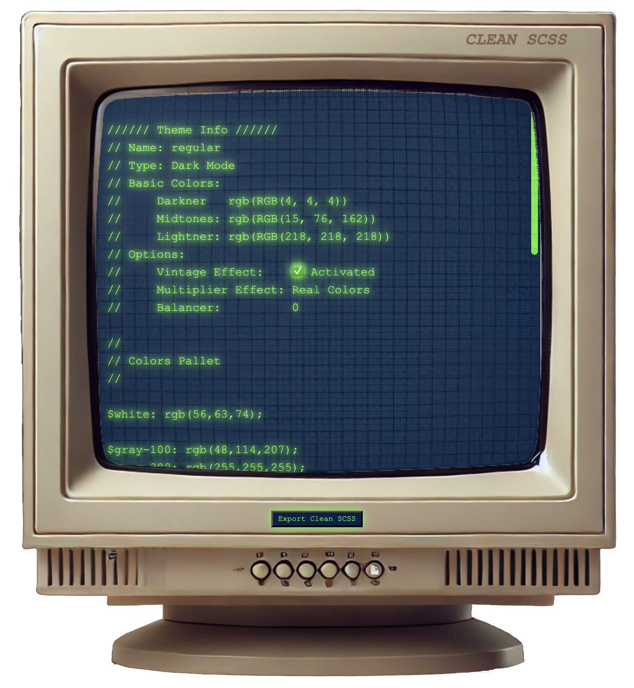
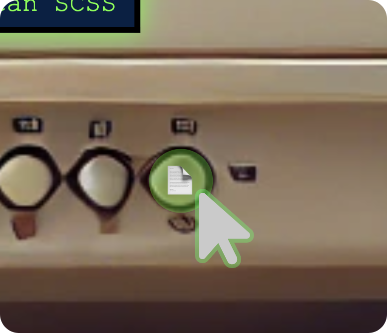

# SCSS Theme Colors Generator (Tre-Formaggi) 🧀🧀🧀


Welcome to **SCSS Theme Colors Generator** – your ultimate tool generate SCSS files with colors pallete to be used instantly.
Whether you’re a developer or a designer, SCSS Theme Colors Generator **"Tre-Formaggi"** helps you generate dark themes by choosing 3 main colors for your theme, the darkner, the midtones, and the lightner. 🚀

## Features ⚡️

- **Theme Customization**:
-- Add one or multiple themes at once
-- Choose the theme from the list
-- adjust multipliers (which sweaps the colors from dark to light and vice versa) (not always recommended!)
-- enable vintage cool effect
-- include/exclude file completion that included pre-defined spacing and fonts
-- later features to be announced! 😉

Note: Balancer is a calculated value and is always recommended to stay 200, but you are free to modify it according to your needs, as min vlaue is 200 and max is 500.

- **Instant SCSS Code Preview**:
Watch your SCSS live as you tweak settings in real-time. 🖥️

- **Export Clean SCSS**:
Download the ready to use SCSS file with all your modifications. 💾
The file name will be _variables_"Your Theme Name".scss

- **Clipboard Copy**:
I you are on a hurry, you can quickly copy your generated SCSS output to the clipboard. ✂️

## How to Use 🔧

1. **Paste SCSS Colors**:
Paste your raw SCSS color data into the input field.
or
write aa new line, bothways it should be in this format:
```scss
theme-name: { darkner: [*, *, *], midtones: [*, *, *], lightner: [*, *, *] }
```
where [*, *, *] is the rgb color values (rgb text is not required, please only calues of rbg colors)
Then Click Generate SCSS to preview the result on the Monitor

2. **Customize Options**:
Choose your theme, adjust setting (if needed) and preview instant changes on the monitor

3. **Copy Generated Code**:
Click the **small round** button to copy generated code to clipboard.




4. **Export Generated Code as SCSS File**:
Download the generated SCSS file with the last modifications you've make "if any", and then use the file directly in your project. 🖱️


## Installation ⚙️

To use this project locally, follow these steps:

1. Clone the repository:

   ```using ssl
   git@github.com:zatismi/ScssThemeColorsGenerator.git
   ```

   ```using https
   https://github.com/zatismi/ScssThemeColorsGenerator.git
   ```

2. Dependencies:
Nothing needed as I use Bootstrap CDN

3. Run the app:
Simple enter the url in your browser or use Open with Live Server in VSCode.

## Contributing 💪

Want to make it even better? Pull requests are welcome! If you have ideas, features, or improvements to suggest, feel free to submit an issue or open a pull request. Let’s make Tre-Formaggie more delicious! 🎉

## License 📄

This project is open-source and available under the [MIT License](LICENSE). Feel free to use, modify, and distribute it in your own projects!

## Feedback & Support 💬

If you run into any issues or have questions, don’t hesitate to reach out through the Issues tab or shoot a message! 😎
---

**Made with 💙 by [Alaa Tahhan at TicketToaster]**
